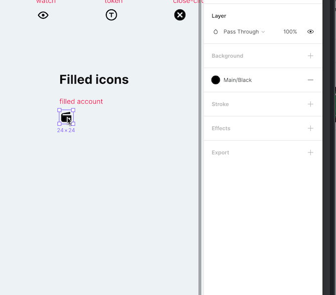

# new icons

## Export icons



## android
1. copy files to corresponding directories at `/Users/romanvolosovskyi/clj/status-react/android/app/src/main/res` (one of `drawable-hdpi`, `drawable-mdpi`, `drawable-xhdpi`, `drawable-xxhdpi`, `drawable-xxxhdpi` for corresponding resolution)
If you only have 3 pngs 1x, 2x and 3x put them in mdpi, xhdpi and xxhdpi 
3. if necessary, rename file so that filename contains only lower case chars, and dashes instead of hyphens, e.g. `"Icon-Name.png"` should be renamed to `"icon_name.png"`.
4. In the app `icon_name.png` still can be accessed as `icon-name`, so in order to use can add the next code:
    ```clojure
    ;; icon_name.png
    [vector-icons/icon :icon-name {:color ...}] 
    ```
    
## ios
1. open xcode (on macos run `open ios/StatusIm.xcworkspace` from project's root dir)
2. go to `StatusIm/StatusIm/Images.xcassets` in xcode

3. add images there
4.  if necessary, rename file so that filename contains only lower case chars, e.g. `"Icon-Name.png"` should be renamed to `"icon-name"`.
5.  **IMPORTANT** there is no need to replace hyphens with dashes, and if you do so you will need to use names with dashes in both android and ios versions. So use dashes for android resources names and hyphens for ios.
6.  And now `"icon-name"` can be added in app the same way as it was added for android version
    ```clojure
    ;; icon-name
    [vector-icons/icon :icon-name {:color ...}] 
    ```
